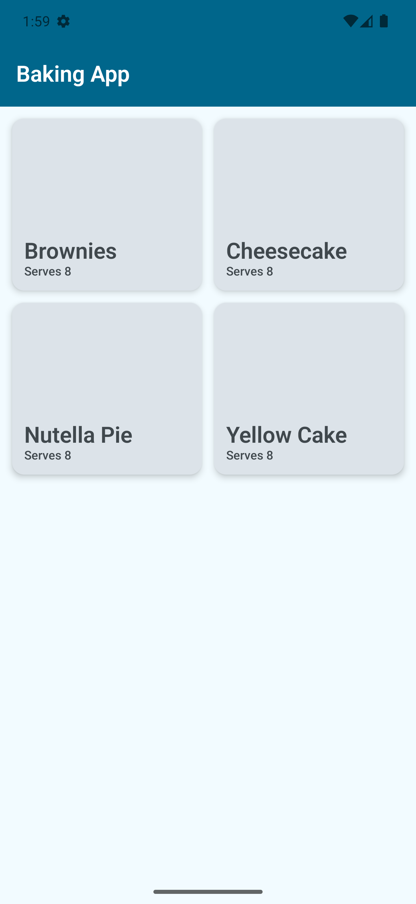
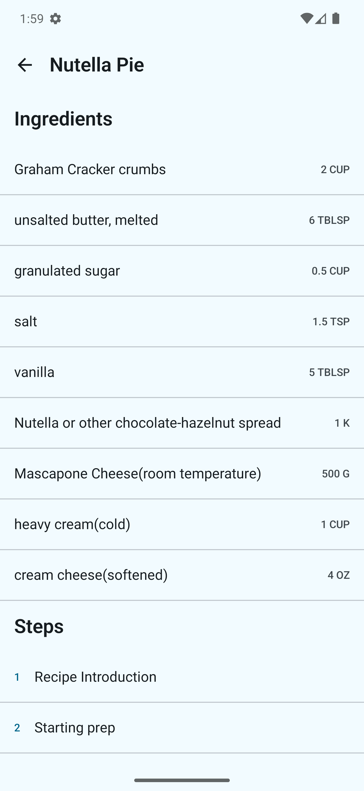
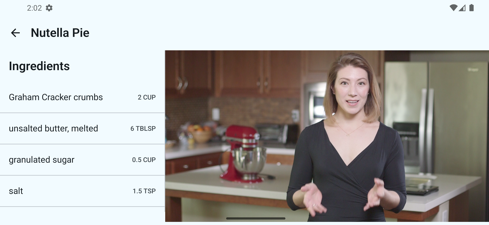
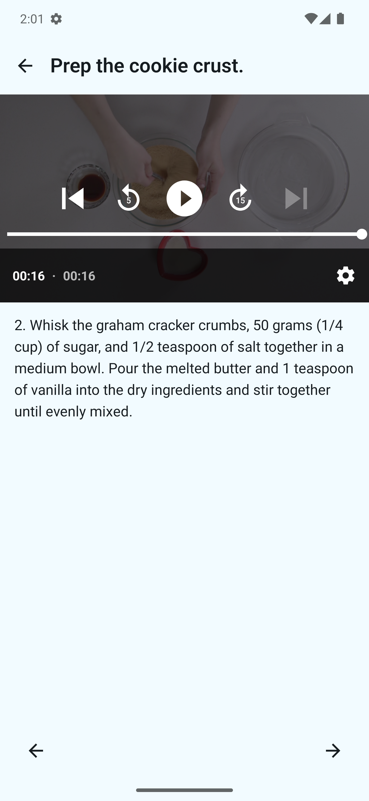
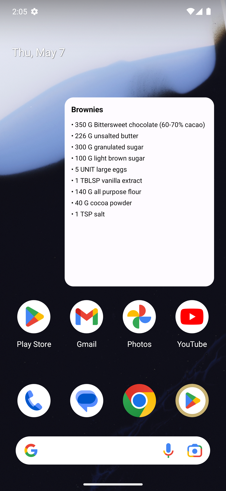
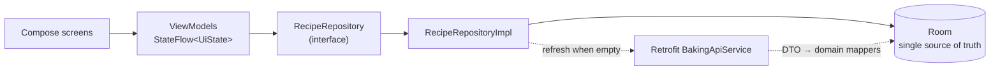

# Baking App

A modern Android recipe app — built as a portfolio piece to showcase a current,
production-grade Android stack. Browse recipes, follow step-by-step instructions
with embedded video playback, and pin a recipe's ingredient list to your home
screen as a Glance widget.

[](https://github.com/Tarek-Bohdima/BakingApp/actions/workflows/ci.yml)
[](https://kotlinlang.org/)
[](https://developer.android.com/build/releases/gradle-plugin)
[](https://apilevels.com/)
[](https://developer.android.com/jetpack/compose)
[](LICENSE)

---

## Overview

Baking App is a **single-activity, 100% Jetpack Compose** Android app with an
**offline-first** architecture. It fetches a small recipe catalog once, caches it
in Room, and renders an adaptive UI that scales from phones to tablets in a
two-pane layout. Step videos are played with Media3 ExoPlayer; a Glance home-screen
widget surfaces the ingredient list for any recipe the user picks.

This is a complete greenfield rewrite in modern Kotlin — every line was written
from scratch against the current Android best-practices baseline (Compose +
Material 3 + Hilt + Coroutines/StateFlow + Media3 + Glance).

## Screenshots

> Drop captured PNGs into `docs/screenshots/` with the filenames below and they
> will render here.

| Recipe list | Recipe detail (phone) | Recipe detail (tablet) | Step player | Home-screen widget |
|---|---|---|---|---|
|  |  |  |  |  |

## Features

- **Recipe list** — grid of recipe cards (name, servings, thumbnail) with loading
  and error states.
- **Adaptive recipe detail** — single-pane on phones, side-by-side two-pane on
  tablets (`maxWidth ≥ 600dp`) with an embedded step player.
- **Step player** — Media3 `PlayerView` plays the step's video; falls back to a
  thumbnail image, then to a text placeholder if neither is present. Previous /
  next controls move between steps within the same recipe.
- **Glance home-screen widget** — pin the ingredient list for any recipe to your
  launcher. Recipe selection is configured via a `WidgetConfigActivity` launched
  when the widget is added.

## Tech stack

| Concern | Choice |
|---|---|
| Language | Kotlin 2.1.21 |
| UI | Jetpack Compose + Material 3 (BOM 2024.12.01) |
| Navigation | Navigation Compose 2.8.x — single-activity, type-safe routes |
| Dependency injection | Hilt 2.56.2 |
| Async | Coroutines + StateFlow |
| Video | Media3 ExoPlayer 1.5.1 |
| Images | Coil |
| Network | Retrofit + Kotlin Serialization |
| Local cache | Room 2.7.1 (coroutine extensions) |
| Widget | Jetpack Glance 1.1.1 |
| Annotation processing | KSP (no kapt) |
| Build | AGP 8.9.1, Gradle KTS, version catalog (`libs.versions.toml`) |
| JVM target | Java 17 |
| Code quality | Spotless (ktlint 1.5.0), Detekt, Kover |
| CI | GitHub Actions |

## Architecture

Standard MVVM with one `UiState` sealed interface per screen. The repository is
the boundary between data and UI; Room is the single source of truth and the
network is only consulted when the local cache is empty (or on explicit refresh).



Every swappable dependency is exposed as an interface and bound in a Hilt module —
ViewModels never see concrete implementations, only abstractions. Domain models
live in `domain/model/` and contain zero Android imports, so the data and
presentation layers can be tested in pure JVM unit tests.

## Project structure

```
com.tarekbohdima.bakingapp/
├── BakingApp.kt              @HiltAndroidApp
├── MainActivity.kt           @AndroidEntryPoint, hosts BakingNavGraph
├── data/
│   ├── local/                Room — BakingDatabase, RecipeDao, entities
│   ├── remote/               Retrofit — BakingApiService, DTOs
│   └── repository/           RecipeRepositoryImpl
├── domain/
│   ├── model/                Pure-Kotlin Recipe / Ingredient / Step
│   └── repository/           RecipeRepository interface
├── di/                       DatabaseModule, NetworkModule, RepositoryModule
├── ui/
│   ├── navigation/           Type-safe routes + BakingNavGraph
│   ├── recipelist/           UiState + ViewModel + Screen
│   ├── recipedetail/         (adaptive layout)
│   ├── stepplayer/           (Media3 PlayerView)
│   └── theme/                Color, Theme, Type
└── widget/                   IngredientsWidget (Glance), Receiver, ConfigActivity
```

## Build & run

**Requirements:**
- JDK 17
- Android SDK with API 36 installed
- Android Studio Ladybug or newer (recommended) — the project uses AGP 8.9.1 and
  Kotlin 2.1.21

**Clone and build:**
```bash
git clone https://github.com/Tarek-Bohdima/BakingApp.git
cd BakingApp
./gradlew assembleDebug
```
The debug APK lands at `app/build/outputs/apk/debug/app-debug.apk`.

**Run on a device or emulator** by opening the project in Android Studio and
pressing Run, or:
```bash
./gradlew installDebug
```

**Common Gradle tasks:**
```bash
./gradlew test                 # JVM unit tests
./gradlew connectedAndroidTest # instrumented tests (device/emulator required)
./gradlew spotlessApply        # auto-format (run before every commit)
./gradlew detekt               # static analysis
./gradlew koverXmlReport       # coverage report → build/reports/kover/
./gradlew lint
./gradlew bundleRelease        # signed AAB (requires signing env vars below)
```

**Signing a release build** requires four environment variables:
```bash
export KEYSTORE_PATH=/absolute/path/to/release.jks
export KEYSTORE_PASSWORD=...
export KEY_ALIAS=...
export KEY_PASSWORD=...
./gradlew bundleRelease
```
In CI these come from repository secrets — see below.

## Data source

The app fetches a single JSON catalog once and caches it locally:
```
GET https://d17h27t6h515a5.cloudfront.net/topher/2017/May/59121517_baking/baking.json
```
No API key is required.

## CI / CD

Pipeline definition: [`.github/workflows/ci.yml`](.github/workflows/ci.yml)

**On every push and pull request:**
Spotless → Detekt → unit tests → Kover coverage → `assembleDebug` → upload debug
APK artifact (7-day retention).

**On pushes to `main`:**
Additionally runs `bundleRelease` and uploads the signed AAB artifact (30-day
retention).

**Required GitHub repository secrets** (for the release job on `main`):

| Secret | Purpose |
|---|---|
| `KEYSTORE_BASE64` | Base64-encoded `release.jks` (encode with `base64 -i release.jks`) |
| `KEYSTORE_PASSWORD` | Store password |
| `KEY_ALIAS` | Key alias |
| `KEY_PASSWORD` | Key password |
| `CODECOV_TOKEN` | Coverage upload (optional) |

## Code quality

- **Spotless** — ktlint 1.5.0, 120-char line limit. Composable functions are
  exempt from the `function-naming` rule. Run `./gradlew spotlessApply` before
  every commit; CI blocks on `spotlessCheck`.
- **Detekt** — config at `config/detekt/detekt.yml`. `MagicNumber` is disabled
  (Compose layout literals are unavoidable); `FunctionNaming` is suppressed for
  `@Composable`s.
- **Kover** — coverage reports written to `build/reports/kover/` and uploaded to
  Codecov on CI.
- **Room schema files** in `app/schemas/` are intentionally committed — they are
  the migration audit trail.

## Roadmap

- [ ] Instrumented Compose UI tests
- [ ] End-to-end Glance widget test on a real device
- [ ] ProGuard / R8 rules for Retrofit + Kotlin Serialization
- [ ] `CHANGELOG.md`
- [ ] Play Store listing assets (icon, screenshots, store description)
- [ ] First Play Store release (`v1.0.0`)

## License

Released under the [MIT License](LICENSE) — © 2026 Tarek Bohdima.

## Author

**Tarek Bohdima** — [@Tarek-Bohdima](https://github.com/Tarek-Bohdima)
